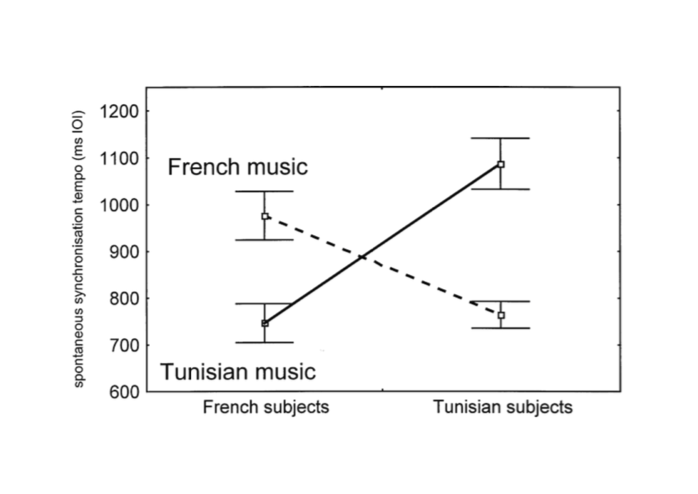

# Design {#ch:design}

## Introduction {#sec:design-introduction}

Many of the problems around validity discussed in Chapter \@ref(ch:validity) can be avoided by properly collecting high-quality data. A study’s *design* indicates which schema or plan will be used to collect the required data. Using a proper and strong design allows us to neutralize many of the possible threats to validity, which increases our study’s strength. Therefore, it is a good idea to spend a good amount of time thinking through your study’s design in advance! Naturally, a study’s design must be closely coordinated with the research question at hand: after all, the data obtained in the study must allow the researcher to give a valid answer to the research question.

The research designs discussed in this chapter are but a limited selection of all possible designs. Some designs will be discussed predominantly to indicate what can go wrong with a "weak" design; conversely, other designs are popular because they enable us to make our research relatively "strong".

A research design is composed of various elements:

  * *time*, usually depicted as passing in the direction of reading. Temporal order is important to be able to establish a causal relationship: the cause comes first, its effect comes later (§\@ref(sec:causality)). However, temporal order is a necessary but not a sufficient condition to establish a causal relationship. Put differently, even when the effect (e.g., recovery) does actually happen after the cause (e.g., treatment), this does not entail that the treatment actually caused the recovery. Perhaps the recovery happened spontaneously, or the recovery is the effect of some other cause not considered in the study.

---

> *Example 6.1*: Imagine Gus: whenever someone has a nettle sting, an insect bite, eczema, or a bruise, Gus sprays some Glassex (Windex) on it – after a few days, the problem vanishes. Gus is convinced his Glassex treatment is the cause of recovery. However, this is a misconception known as "post hoc ergo propter hoc" ("after this, therefore because of this"; also known as "post hoc fallacy"). It is most probable that the problem would have healed properly even without the Glassex treatment. The recovery itself does not prove that the Glassex treatment is necessary for recovery. (This example is taken from the 2004 feature film, *My Big Fat Greek Wedding*).

---

* *groups* of units (e.g., participants); a group will usually correspond to a line in the design.

* *treatment*, normally depicted as X (as in X-ray). Types of treatment may also include a lack of treatment ("control"), or non-experimental usual care.

* *observation*, normally depicted as O (as in Oscar).

* *assignment* of participants to groups or conditions of treatment may happen in various ways. Most often, we will do this at random (indicated below as "R"), because this usually leads to the best protection of the study’s validity.


## Between or within ? {#sec:betweenwithinparticipants}

For the study's design it is important whether an independent variable is manipulated between participants or within participants. In many studies in linguistics, in which multiple texts, sentences, or words are offered as stimuli, the same is true of distinctions between stimuli versus within stimuli. Variables that are individual to the participant, such as sex (boy/girl) or whether they are multilingual, may normally only vary between subjects: the same participant may not participate in both sex groups in a study, and monolingual participants may not participate in the group of multilingual participants. However, with other variables, which have to do with the way in which stimuli are processed, this is, indeed, possible. The same participant might write with their left and their right hand, or may be observed preceding and following treatment. In this case, the researcher must choose in their researcher design how treatment and observations are combined. We will return to this in §\@ref(sec:within-subject-designs).
	
	
## The one-shot single-case design {#sec:one-shot-single-case-design}

This is a weak design, in which observations are made one single time: after treatment. This research design may be schematized as follows:

```
  X   O
```

For instance, we might count for all final projects written by students in a particular cohort of a particular programme how many errors (of a certain type) occur in these final projects. This may generate some interest, but these data have very little scientific value. There is no way to compare this to other data (for other students and/or for other projects by the same students). It is not possible to draw a valid conclusion about possible effects that "treatment" (studying in the programme, X) might have on the observations (number of errors, `O`).

Sometimes, data from a one-shot single-case study are forcibly compared to other data, for instance, with normative results for a large control group. Imagine we would like to investigate whether a new method of teaching languages would lead to better language ability in the target language. After a course that uses the new teaching method, we measure language ability and compare it to previously published results for a control group that used the traditional teaching method. This approach is frequently used, but, notwithstanding, there are various factors that threaten its validity (see §\@ref(sec:internalvalidity)), including history (the new participants have different histories and biographies compared to the control group in the past), maturation (the new participants might have undergone more extensive or less extensive development compare to the control group), instrumentation (the test might not be equally suitable for individuals taught by the new teaching method as it is for those taught by the traditional method), and attrition (attrition of participants prior to the observation is not known, neither for the traditional method, nor for the new method).

---

> *Example 6.2*:	An interviewer may ask so-called ‘closed’ questions, which only have a few possible answers (*which of these three kinds of vegetables do you like best: peas, green beans, or broccoli?*), or ‘open’ questions, in which the way the question is asked does not limit the possible answers (*what kind of vegetables do you like best?*). There is also a third category, namely, open question with example answers (*what kind of vegetables do you like best, for instance, peas, or green beans, or...?*). However, it is not clear whether these example answers do or do not have a guiding effect, i.e., whether such questions are rather comparable with closed questions, or with open ones. @Houtk91 studied recorded conversations between doctors and their patients. The doctors would frequently ask open questions with example answers. Most of the time, patients turned out *not* to have interpreted the question as a guiding one; they primarily interpreted the question as a prompt for narration.

> This study can be seen as a one-shot single-case design, without any comparison with data from other conditions. While the conclusions drawn are, indeed, based on empirical observations, we do not know what answer the interviewee would have given if the question had been posed differently.

---

Despite all these drawbacks, a one-shot single-case study may be useful during the observation phase within the empirical cycle, when the objective is to get some ideas and to formulate (global) hypotheses, which may be tested later.

## The one-group pretest-posttest design {#sec:one-group-pretest-posttest-design}

In a one-group pretest-posttest design, data are collected for one group. At the first point in time (usually indicated as `T1`, but sometimes as `T0`), a first measurement is carried out (pretest, `O1`), after which the group is exposed to an experimental treatment, following which, at a later point in time (`T2`), a second measurement is taken (posttest, `O2`). A one-group pretest-posttest design may be schematized as follows:

```
  O1   X   O2
```

As shown in the diagram, the treatment, `X`, does not vary: everyone gets the same treatment, because there is just one group. The time of measurement, usually indicated as a pretest, `T0` (`O1`), and a posttest, `T1` (`O2`), varies within participants.

This design is generally better than the previous one-shot one-case design, and it is definitely better than having no data at all. Despite this, we still consider it a weak research design, because it fails to address various threats to validity (see §\@ref(sec:internalvalidity)). Any difference between `O2` and `O1` may not exclusively be attributed to treatment `X` that was carried out in between: this effect might also be the consequence of maturation (improvement follows from participants’ maturation) or of history (improvement follows from one or several events other than `X` that occurred between the time of `O1` and that of `O2`). If the treatment, `X`, or the posttest, `O2`, is dependent on participants’ scores on the pretest, `O1`, then regression to the mean may also threaten validity. In short, this research design has various drawbacks because the hypothesis about the independent variable’s effect cannot always be answered in a valid way.

## The pretest-posttest-control group design {#sec:pretest-posttest-control-group-design}

The problems mentioned above can partially be solved by adding a control group to the design, which results in a pretest-posttest-control group design. This means that the study involves two groups of elements (participants), which, in a diagram, is shown as two lines. This design is used very often. Whenever possible, researchers try to make the two groups as closely comparable as possible by assigning subjects to the two groups at random. This model can be schematized as follows (`R` stands for random assignment to the two groups):

```
  R   O1   X   O2
  R   O3       O4
```

This research design is popular because it can neutralize many threats to internal validity (see §\@ref(sec:internalvalidity)). The effect of the manipulation or treatment (`X`) is evaluated by comparing two differences, `(O2 – O1)` and `(O4 – O3)`. Strictly speaking, this research design has not one but two independent variables that may influence measurements: (1) the manipulation or treatment, `X` or not `X`, varying between subjects, and (2) the time of measurement, usually indicated as a pretest, `T0`, and a posttest, `T1`, varying within subjects.
	
This design does take effects of history into account, at least, to the degree that such effects may have occurred equally for both groups. It does not take into account events that might have influenced just one of the groups (conditions). This does means that, if such an event has occurred for one group and not the other, this difference in history might also be responsible for an unequal difference between pretest and posttest in one group compared to the other.

Threats to internal validity coming from maturation can be easily eliminated in this research design. After all, we expect any effect of maturation to be equally manifested in both groups, which is why it cannot be of any influence on the difference between `(O2 – O1)` and `(O4 – O3)`. Of course, this does presume that the pretest was administered to both groups at the same time, and that the same holds for the posttest.

Any disruptive effect of instrumentation is likewise neutralized, as long as the requirements on comparable conditions of measurement are satisfied, and measurements are taken with the same instrument, for instance, the same device, computer program, or printed test. However, if observers or raters are recruited, like in the case of research into writing ability, instrumentation becomes a more complicated factor. In this case, it is highly important that these raters do *not* know which participants produced the fragments or responses to be judged, or under which condition this happened. Otherwise, the raters may (unwittingly and unintentionally) allow their expectations to play a role in the formation of their judgment. In this latter case, we would not be showing an effect of the independent variable, but an effect of the raters' bias.

The problem of regression to the mean also plays a smaller role in this design. In case the participants have been randomly assigned to one of two groups, and all participants’ data are entered into an analysis at the same time, regression to the mean does not play any role, since regression to the mean is expected to take place at equal rates in both groups, so that it does not have any influence on our analysis of the difference between `(O2 – O1)` and `(O4 – O3)`.

The problem of participant selection is excluded in this design by randomly choosing the sample of participants from of the entire population, and by then randomly assigning participants to one of both groups or conditions. Naturally, the law of large numbers is at work here: if a larger sample is randomly split into two groups, there is a greater chance that the two groups will be equivalent compared to when the same is done for a smaller sample.

However, attrition can actually be a reason for a difference between `(O2 – O1)` and `(O4 – O3)`. This threat to validity is difficult to control. After all, we cannot force a participant to keep participating in a study, and we cannot stop them from moving or passing away. Therefore, attrition may form a problem, especially when attrition rates differ between the two groups or conditions. It is best practice to report any attrition in the research report, and to discuss any potential consequences it may have.

Summarizing, we can say that this pretest-posttest control group design allows us to control the various factors that threaten internal validity reasonably well. But how about construct validity (see §\@ref(sec:constructvalidity)))? These threats were not touched upon earlier in our discussion of the one-shot one-case design and the one-group pretest-posttest design, because these designs already generated serious doubt regarding their internal validity.
	
It must be said that not all aspects of construct validity have repercussions for a study’s design. Some aspects that concern manner of operationalization, such as convergent and divergent validity, are irrelevant to choosing a research design. However, other aspects are, indeed, relevant: the researcher’s expectations, attention, motivation, and the guiding influence of pretests.

The pretest-posttest control group research design does not provide adequate guarantees for any of these four threats to construct validity. The researcher’s *expectations* may play a role both in the experimental and control conditions, even if it is a different role. This because there are two measurements at two points in time. Moreover, any difference between `(O2 – O1)` and `(O4 – O3)` might be attributable to the (additional) *attention* given to the experimental condition: the so-called Hawthorne effect (see example 5.10 in Chapter \@ref(ch:validity)). This effect plays a role predominantly if participants in one condition (group) receive more attention compared to the other condition (group), as is the case in the Hawthorne effect.

A third threat to construct validity is formed by *motivation.* Sometimes, one of the conditions can be so demoralizing that participants in this condition stop seriously participating in the study. Just like in the case of attention, the crucial factor is not so much the appeal of a particular condition, but any differences between conditions in terms of their appeal.

In addition, construct validity in the pretest-posttest control group design can be threatened by the guiding influence of *pretests.* Because of a pretest (`O1` and `O3`), participants may develop a (greater) awareness of certain aspects of the study, which means that they will no longer behave like naïve participants. In such cases, the pretest can be considered to be a type of manipulation (see example 6.3 below).


## The Solomon-four-groups design {#sec:solomon-four-groups-design}

The Solomon four-group design is used much less often than the pretest-posttest control group design. Despite this, the former design is clearly preferable to the pretest-posttest control group design: in particular, it allows for better control of threats to construct validity.

In the Solomon four-group design, four conditions are distinguished, to which participants are assigned at random. In the first two conditions, a pretest is administered first, after which one of both groups is given the experimental treatment. Then, both groups undergo a posttest. Up until this point, the Solomon four-group design is identical to the pretest-posttest control group design. However, no pretest is administered in the third and fourth conditions. In one of the two conditions, participants are given the experimental treatment, but not in the other condition. Finally, both of these groups are given a posttest. We may schematize the Solomon four-group design as follows:

```
  O1   X   O2
  O3       O4
       X   O5
           O6
```

Summarizing, we can say that the Solomon four-group design is an expansion of the pretest-posttest control group design by two groups, which do not participate in the pretest. Because of these two additional conditions with no pretest, we can take into account the guiding influence of pretests (see example 5.14), since this guiding influence is absent from the third and fourth groups. In addition, the effect of manipulating the independent variable, `X`, is tested several times, namely, in the four comparisons of `O2` versus `O1`, `O2` versus `O4`, `O5` versus `O6`, and `(O2 – O1)` versus `(O4 – O3)`. The effect of the possibly guiding pretest is tested in the two comparisons of `O2` versus `O5`, `O4` versus `O6`. Thus, we can show effects of both treatment and pretest in the same study. However, this does mean we must employ two additional groups of participants (compared to the pretest-posttest control group design).
	
---

> *Example 6.3*: A study done by @AHW00 examined the effect that habituation training (`X`) has on fear of public speaking. Fear of public speaking was measured by having the participant first hold a speech, and then fill out two questionnaires on fear of (public) speaking. These together form one measurement. One group received habituation training by watching a training video that lasted about 20 minutes; the second group was given a break of the same duration, instead. The study used a Solomon four-group design to allow for studying a possible guiding influence of the pretest. After all, it is possible that the pretest (of which the talk they gave was a part) itself forms an instance of training for the participants, so that any positive effects after "treatment" `X` (habituation training) may not be attributed to said treatment, but (also) to the pretest. However, the results showed that the habituation training, indeed, did have a strongly favourable effect on fear of public speaking, and that the pretest alone (with no treatment) had no effect at all on participants’ degree of fear of public speaking.

--- 


## The posttest-only control group design

A great amount of studies feature a pretest, because researchers want to demonstrate that the two (or more) groups researched do not differ from one another at the beginning of the study. Nevertheless, an adequate research design does not have to feature a pretest. If the groups are of sufficient size, and if participants (or other units of interest) have been assigned to groups in a completely random way, statistical analysis alone is sufficient to show that the groups are quite comparable. For instance, if we divide 100 participants between 2 groups in a completely random way, there is an extraordinarily small chance of the two groups’ showing a difference on the pretest. Therefore, for many cases like this, a posttest control group design is sufficient. This design may be schematized as follows:

```
      X   O5
          O6
```

However, this design is only adequate if the groups are large enough, and if participants have been randomly assigned to the conditions. If these demands cannot be met, this design is also insufficient.

---

> *Example 6.4*: Following up on the study by @Houtk91 (see example 6.2), @Wijff92 investigated to which extent questions with or without example answers are interpreted as guiding the listener in an oral (phone) interview. To this purpose, five questions on crime were constructed. Two versions of each question were made: one with example answers, and one without.  Each respondent (in a sample of 50) was asked two to three questions with example answers, and two to three questions without example answers. The division of questions between the two types (with or without example answers) was randomized, which means that we may assume that the group of respondents that heard a particular question with example answers does not differ from the group of respondents that heard the exact same question without example answers. If both groups answer the same or similarly, we may assume that example answers have no guiding effect, but if respondents often use example answers to respond to a question, we may assume that the example answers do have a guiding effect. Analysis revealed that such a guiding effect did, indeed, occur for 4 out of 5 questions.

---

These two studies, @Houtk91 and @Wijff92, illustrate the gradual progress of scientific knowledge. @Houtk91 establishes that the professional literature has predominantly looked at written interviews, and asks whether the same effects are seen in oral face-to-face interviews. She concludes that, in face-to-face conversations, example answers do not have a guiding influence. @Wijff92 investigate the same hypothesis in an experiment that uses oral interviews over the phone, and conclude that example answers do have a guiding influence in these phone conversations.


## Factorial designs {#sec:factorial-designs}

So far, we have talked about experimental designs in which one single independent variable is manipulated. However, many researchers are (also) interested in the effect of simultaneously manipulating multiple independent variables. Designs in which several factors are varied at the same time are called factorial designs. We already saw an example of this in our discussion of the pretest-posttest control group design (§\@ref(sec:pretest-posttest-control-group-design)), in which both time and treatment were varied.

---

> *Example 6.5*: @Drake03 investigated the perception of musical structure. We may indirectly measure this perception by asking listeners to tap along with the music. If a listener does not understand or recognize the structure of a musical fragment, they will tend to tap every beat (analytical listening). The better a listener understands and recognizes a fragment’s structure, the more they will tend to tap along with higher-level units (synthetic or predictive listening): they will not tap once every beat, but once every measure or once per musical phrase. The time interval between taps (called the inter-onset interval or IOI) thus forms an indication of the perceived musical structure. Two groups of listeners participated in the study: one in France and one in Tunisia[^fn06-1].  All participants listened to 12 pieces of music, of which 6 derived from French musical culture, and the other 6, from Tunisian musical culture (the pieces of music differed in terms of time signature, tempo, and degree of popularity). Results are summarized visually in Figure 6.1.

```{r drakebenelheni2003fig2, echo=FALSE, fig.cap="Average time interval between taps (IOI, in ms) for two groups of listeners and two types of music (from Drake and Ben El Heni, 2003, Fig.2).", fig.align="center"}

```

> These results show that there is no difference between both groups (French vs. Tunisian listeners; both groups have the same IOI on average), and that there is also no difference between both types of music (French vs. Tunisian music; both types of music result in the same IOI on average). Does this mean that the two independent variables have no effect at all? They absolutely do: it turned out that French listeners produced longer IOIs between taps when listening to French music, while, on the other hand, Tunisian listeners produced longer IOIs when listening to Tunisian music. Thus, all listeners produced longer IOIs when listening to a type of music they knew, and shorter IOIs when listening to a type of music they did not know. @Drake03 conclude that listeners are better able to recognize and understand musical structure in music from their own musical culture compared to music from another culture. This pattern is a classic crossover interaction effect, in which one independent variable’s effect is exactly opposite in the various conditions defined by the other independent variable.

---

If it turns out that there is an interaction effect, we cannot sensibly interpret any main effects. This was already illustrated in example 6.5: we cannot conclude that there is no difference between the types of music. However, the size (and direction) of the difference depends on the other independent variable(s), in this case, group/nationality of listeners. Many studies are specifically aimed at demonstrating interaction effects: it is not main effects that are the topic of research, but their interaction, precisely as in example 6.5 above.

It is difficult to schematize a factorial research design, because it features multiple independent variables (with multiple levels each). We could schematically represent these by indexing the manipulation, which was previously shown simply as `X`. The first index (subscript) indicates the level for the first independent variable or factor, while the second index indicates the second factor’s level. Following this system, we can schematize the design from example 6.5 as follows:

```
  R    X_{1,1}   O1
  R    X_{1,2}   O2
  R    X_{2,1}   O3
  R    X_{2,2}   O4
```

Combining many factors into one big factorial design may often seem seductive: why not investigate how all these factors interact with one another? However, the most sensible option is not to do this, and, instead, limit the number of factors. Firstly, as we will see later, the number of observation has to keep up with the number of possible combinations of factors. Adding more factors means that many more participants (or other units) are needed. Secondly, it is more difficult to guarantee that all combinations of factors are perfectly comparable [@SCC02, p.266]: may we reasonably compare Tunisian participants listening to Tunisian music in Tunisian with French participants listening to French music in France? The more combinations of factors are featured in the study, the trickier it becomes to ensure that these combinations are comparable. Thirdly, interactions are notoriously difficult to interpret, which also becomes trickier as interactions become more complex and span a greater number of factors. For all of these reasons, it is better to study the effects of multiple factors in separate individual studies [@Quene10].

We will come back later to the analysis and interpretation of data from factorial experimental designs (Chapter \@ref(ch:anova)). 
In the meantime, we will concentrate on designs that have just one independent variable.


## Within-subject designs {#sec:within-subject-designs}

At the outset of the chapter, we spoke about manipulating an independent variable either between or within subjects (§\@ref(sec:betweenwithinparticipants)). In most designs discussed above, a separate group was formed for each value of the independent variable(s); we call this a between subjects design. The independent variable’s value differs between participants.

However, some independent variables may also be manipulated within participants. In such cases, we take repeated measures for (within) the same participants from the same group, switching out different conditions of the independent variable. In the example below, the independent variable, ‘language’ (native or non-native), is varied within participants. We call this a within subjects design.

---

> *Example 6.6*: @JGSH13 investigated the fluency of participants’ speech in their native language (Turkish) and in a non-native language (Dutch). The participants first performed a number of speech production tasks in their native language, a few weeks after which they did the same for Dutch. One of the dependent variables was the number of filled pauses (e.g., *uh, uhm*) per second of speech: the greater the prevalence of pauses, the lesser the degree of fluency. As we might expect, the speakers did turn out to produce more pauses (i.e., speak less fluently) in the non-native language compared to their native language. However, one of the goals of this study was to investigate to which extent we may trace back individual fluency differences in the non-native language to individual fluency differences in the native language. These two measurements turned out to be highly correlated ($r = 0.73$; see Chapter \@ref(ch:correlation-regression) for more on this). Speakers that have many pauses in the non-native language also have many pauses in their native language. The researchers argue that we must take this correlation into account when teaching and testing speaking ability in a non-native language.

---

The research design described here can be schematized as follows:
	
```
   X1   O1   X2   O2
```

Despite the many threats it poses to internal validity (including history, maturation, guiding influence of pretests), such a design is often useful. In the example above, it is essential that it is the *same* participants that carry out speaking tasks in both languages (conditions) -- no other method will be adequate for answering the research questions.


## Designing a study

A researcher who intends to carry out a study has to settle on a way of collecting data: they have to choose a particular design for their study. Sometimes, a standard designed may be chosen, for instance, one of the designs discussed above. In other cases, the researcher will have to devise their own design. Naturally, the design chosen should fit well with the research question [@Levin99], and it should exclude as many disruptive, potentially validity-threatening variables as possible. Designing a study is a skill that researchers hone with practice. In the example below, we will try to show to you which reasoning and arguments play a role in developing a design for a study.

Suppose that we would like to investigate whether the way in which test questions are asked,   as open vs. closed questions, influences students’ scores on the relevant test. If we use a simple design, we will first administer a test with open questions to a group of respondents, and then, a comparable test with closed questions to the same respondents. If the resulting scores are sufficiently correlated, we conclude that both tests measure the same thing, and that performance on the test is not significantly influenced by the way questions are asked. This design can be schematized as follows:

```
   Open   O1   Closed   O2
```

However, this research design does have various weaknesses. Firstly, it is not prudent to first administer all open question tests at the first time point, and leave all closed question tests for the second time point. This is because performance on the second test will always be influenced by effects of ordering (transfer effects): respondents remember and, thus, learn something from the first measurement. However, this transfer always works in one direction, which means that we expect relatively higher performance on the test with closed questions (at the second time point). Because of this, it is better to randomly distribute the open question and close question tests between the first and second time point.

Secondly, all respondents might have been influenced by any events that took place between the two time points (history), for instance, by some instruction relevant to the test’s subject matter. Because there is no control group, we cannot take this type of effect into account.

A third problem lies in the way in which the reasoning from findings to conclusions is constructed. For the current example, we defined this reasoning as follows: if scores on both tests are sufficiently correlated, both tests measure the same thing. If you stop and think about it, you might agree with us that this is a strange bit of reasoning. The underlying research question really seems to be whether the correlation between performance on different tests with different types of questions is the same as the correlation between performance on different tests with the same types of questions, since we do assume that the latter group of tests measure the same thing. This, in itself, defines a control group: respondents who, at both points in time, write tests with the same types of questions. Just to be sure, let us add not one, but two control groups: one with open questions at both time points, and one with closed questions at both time points.

By doing this, we have improved the design in at least two ways: (1) tests are randomized between times of measurement, and (2) relevant control groups have been added. At this point, we may schematize our design as follows:

```
       Exp. group 1       Open    O1   Closed   O2
       Exp. group 2      Closed   O3    Open    O4
      Control group 1     Open    O5    Open    O6
      Control group 2    Closed   O7   Closed   O8
```

For all four groups, we may now determine the correlation between their performance at the first and the second time point. We can subsequently compare these correlation results between the four groups, and use this to answer the research question. This example shows us that the conclusions that can be draw from research results are directly dependent on the design that was chosen [@Levin99]. In the first design, a low correlation would lead to a conclusion that the two types of testing investigated do *not* test for the same intellectual skills in our respondents. However, in the second design, the same low correlation in the first group (experimental group 1) does not have to lead to the same conclusion! This is because the conclusion also depends on the degree of correlation that was found in the other groups.

##  In conclusion

Despite all the books, manuals, websites, and other instructional materials that are available, it is still much too often that we encounter studies with methodological problems in their research questions, operationalization, design, drawing of samples, and/or data collection. Not only do these problems cause a waste of time, money, and energy, but they also yield knowledge that is less reliable, valid, and robust than would otherwise have been possible. The following checklist for good research practice (partly taken from <https://www.linkedin.com/groups/4292855/4292855-6093149378770464768>) may preempt many problems during a study’s later stages.

1.	Give your research questions plenty of thought, and formulate them fully into the smallest detail. If the questions have not been formulated clearly, or if there are many sub-questions, keep working on the questions.

2.	Arrange the research questions according to their priority. This will help in making good choices regarding design, sampling, operationalization, etc.

3.	Think long and hard about your study’s design. According to an informal rule of thumb, each hour spent thinking about your study’s design will save you 10 hours of additional data analysis and interpretation in the future. Put differently: spending an hour less on thinking about your design will cost you 10 hours of work down the road.

4.	Think of various alternative designs for your study, and think about each possible design option’s advantages and disadvantages.

5.	Imagine the future: you have completed your research project, analysed your data, and written your report or thesis. Which message would you like to impart upon the readers of your report? How does your study’s design contribute to this message? What might you change in your design to make this message even clearer? Think of the direction you would like to take, not just of where you are now.

6.	Write a research plan in which you describe the various methodological aspects of your study. Explain the details of and the reasoning behind your research questions, design, sample, method of measurement, data collection, instruments of measurement (e.g., questionnaire, software), other requirements (e.g., laboratory environment, transportation), and statistical processing. You will be able to reuse parts of this research plan in your report. When writing your plan, make sure to include a schedule: when will which milestone be reached?

7.	Write out what statistical analyses you will use on your data before your actually start collecting any data. Again, be as explicit as possible (using a script, step-by-step plan, or similar). Make up a miniature collection of fake observations, or real observations from the pilot phase of your study, and analyse these data as if this were your definitive collection of data. Make adjustments to your research plan as needed.

8.	Once you are collecting data, do *not* make any changes to your research plan. Keep to this plan and the schedule you made. Analyse your data in the way specified in the (previously adjusted) research plan. Do discuss in your report any problems that arose during the study. If serious problems occur, halt your project, and consider starting anew with an improved version of your study.


[^fn06-1]: Note that participants are not randomly assigned to one of these two groups, which, strictly speaking, makes this a quasi-experimental study (see Chapter 1).
